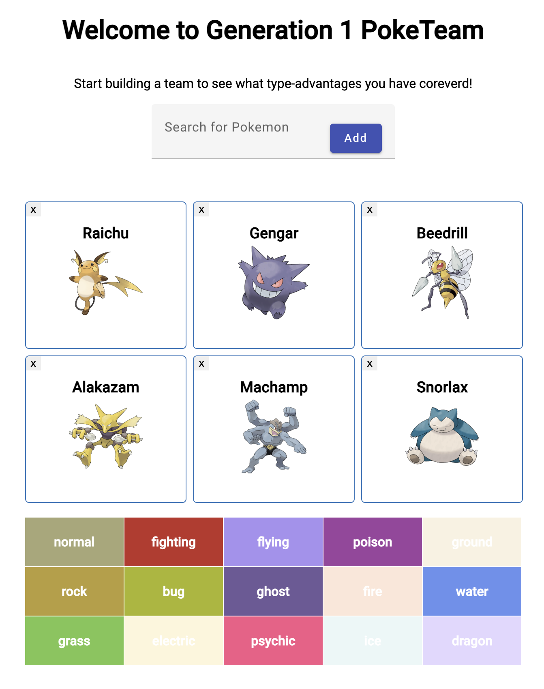

# Poketeam

This is a small Angular app to show what type advantages a generation 1 Pokemon team has.

## Requirements

* [Angular](https://angular.io/) (and thus Node.js & npm)
* [Angular Material](https://material.angular.io/)

If you want to use the utility script to scrape Pokemon images:
* [Python](https://www.python.org/)
* [Requests](https://requests.readthedocs.io/en/latest/)
* [BeautifulSoup](https://www.crummy.com/software/BeautifulSoup/bs4/doc/)

## Installation

```
git clone https://github.com/ghbhc/poketeam.git
cd poketeam
ng add @angular/material
```

To set up and use the image scraping script:
```
python -m venv ~/envs/requests
. ~/envs/bin/activate
python src/utils/get-poke0imgs.py
```

Example team:



This project was generated with [Angular CLI](https://github.com/angular/angular-cli) version 15.1.1.
